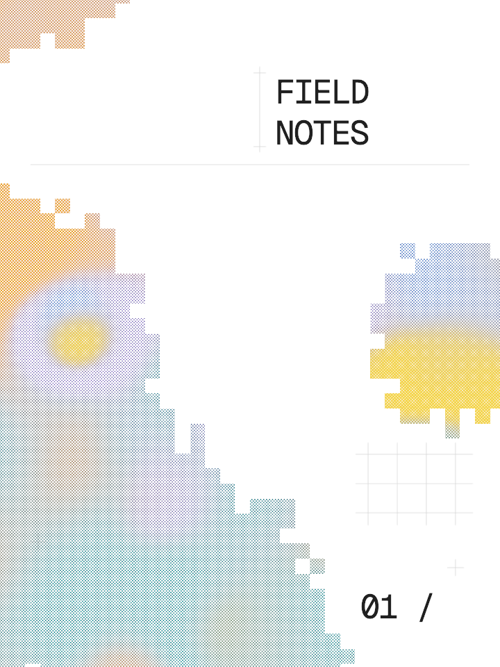
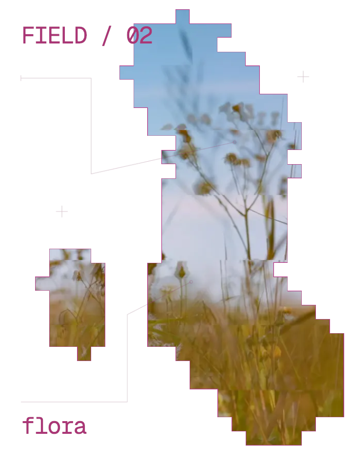

# Editable V3 studies

Two starting points for the editorial direction in [V3 visual references](../../../V3-VISUAL-REFERENCES.md). These are original compositions using existing app media, procedural layers, editable text, and original SVG linework; the user's reference images are not bundled.

Open the editor, choose **Export → Project → Import .lab**, and select a study. Save your current project first: importing replaces the scene. On the local dev server, download [Color Field](http://localhost:55000/examples/v3/color-field.lab) or [Painted Flora](http://localhost:55000/examples/v3/painted-flora.lab). The files also work on the deployed branch that includes their bundled assets. The preview PNGs were rendered at 720 × 960. The current editor canvas follows the window size, so importing into a wider viewport changes the framing; these are editable studies, not fixed-size poster templates.

## Color Field

[Open project file](color-field.lab)

The layer order inside **Color / fine dots**, from top to bottom, is:

1. **Stepped regions** — Photographic Cells: Regions, Random, Cell Size 0.03, Region Size 0.4, Edge Scatter 0.65, no outline.
2. **Fine source-color dots** — existing Halftone: Source, Spacing 3, Dot Size 0.8, Dot Min 0.45, Angle 45°.
3. **Blue / ochre / violet** — existing Gradient: five editable color points, modest distortion, animation off.

Cells cuts the already dotted color field. At 720px width the cells are about 22px wide, so several dots fit inside each cell. The group isolates the effects; text and registration marks remain outside. Source mode uses one dot grid; CMYK uses four and is more expensive. No new halftone controls or extra colorization pass were needed.

Try **Edge Scatter 0 → 0.65 → 1**. Small notches and detached cells should appear near the boundary while the broad patches remain. **Seed** changes both the automatic regions and their edge pattern. **Cell Size** changes the fragment scale; **Region Size** changes the broad patches. Turn on Gradient's **Animate** for a moving color source inside a fixed Random selection.

## Painted Flora

[Open project file](painted-flora.lab)

**Painted specimen** contains Cells above the photo. The saved Paint mask reveals a broad diagonal specimen and a detached patch; a fine pink Perimeter follows the result. Text and annotation linework stay outside the group. The photo is the app's existing `slice.webp`, copied into its allowed bundled-media directory so import does not require relinking.

Select **Painted photographic reveal → Edit Paint** to reveal or erase areas. **Done** removes the temporary source guide. Try Edge Scatter at 0 and 0.5: it modifies the edge without overwriting your strokes. The saved example uses 0.25. Photograph pixels stay in their original positions inside each selected cell.

Text, colors, coverage, source, and layer order remain editable. The technical marks are separate SVG image layers: move, fade, hide, or replace them in the editor; edit their paths in the SVG files for different linework. They are not a new vector drawing tool.

## Scope and performance

These studies demonstrate broad color patches, finer dots, small edge fragments, photographic interiors, a thin colored perimeter, white space, and separate type/linework from references 05 and 11. They are not reproductions or final approval of the entire V3 visual direction. Paper distress, denser annotations, and finer typography remain further work; the existing 48px text minimum still limits small labels at this canvas size.

Scatter only shifts the point used to read selection, by at most 1.5 cell widths/heights per axis at maximum. Geometry and photographic sampling stay unchanged. It adds arithmetic, no extra source samples, full-screen pass, render target, or readback. Zero is the default and restores earlier behavior. Individual Cells ignores Scatter. Very narrow painted details can fragment at high amounts; reduce Scatter or Cell Size to retain them. Random/Paint remain fixed while video plays; Light/Dark regions react to video tones and can change cells.

The studies are static by default. A short decoded-video software benchmark found similar 1080p pass medians with Scatter off/on (Random 60/60.8ms, Light 91.7/90.4ms, Paint 56.6/56.6ms). This is not native GPU FPS, sustained load, or a thermal diagnosis. Timing includes video upload and queue completion, excludes waiting for the next frame, and uses two warm-up plus five timed frames. Native hardware, full effect stacks, and encoded video export remain open in roadmap 7.2.

Rebuild the project files with `bun scripts/generate-editorial-studies.ts`. The PNGs are actual editor-renderer exports, not mockups. Browser QA: `bun tests/composition/editorial-studies-ui.mjs` with the dev server running. Bounded video comparison: `bun tests/composition/effect-video-performance.mjs --scatter`.
